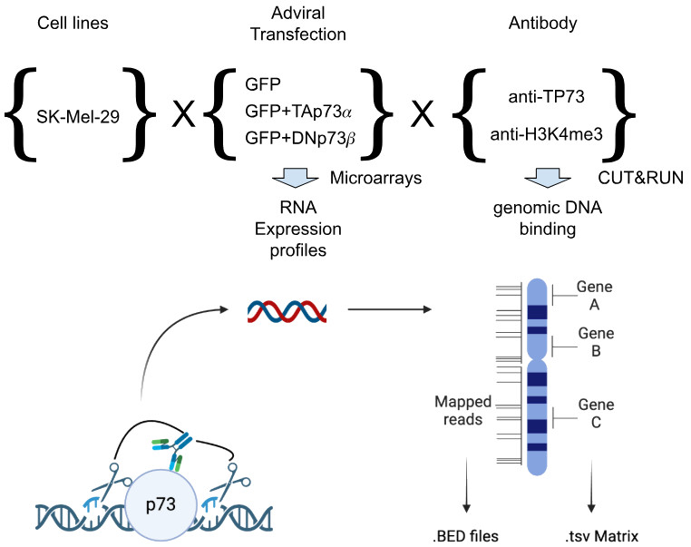

This repository accompanies a publication recently submitted. It performs the
 - differential analysis of _*CUT&RUN*_ data that describe the binding of two variants of the transcription factor p73
 - under consideration of the _*JASPAR*_ database of transcription factor DNA binding motifs.

Applied on the melanoma cell line SK-Mel-29 we thus determined 
 - what cofactors in the immediate vicinity of a p73 binding site (as predicted by JASPAR)
 - is beneficial or detrimental to see the JASPAR-predicted theoretical binding site confirmed by the experimental CUT&RUN data,
 - and how this differs upon overexpression of the full length variant TAp73α of p73, the cancer-specific DNp73β and endogenous levels.

Besides helping with reproduction of our findings, we anticipate
the here outlined approach to be adapted (and improved) for other transcription factors. Please get in touch.

## Requirements

For the paper we used

* Data on p73 binding
  - CUT&RUN:  E-MTAB-15709
  - CoIP Mass spectrometry: PXD058816
  - Expression data: E-MTAB-14704
* Jaspar release 2022
* Ensembl version 112

Compute facilities:

* Storage: ~1 TB for gzipped .bed files generated by JASPAR mapping, more for the 2024 release
* Compute time: <4 weeks on a small cluster of ~20 nodes

## Methods

* Raw data was analysed with protocols of https://nf-co.re.
* Mapping of JASPAR to the genome was performed with the here presented C program, the bed tools and shell scripts.
* R was used for downstream analyses and visualisation.

## Installation

To execute this program
 1. Compile binaries
    - Install dependencies:
      UNIX: sudo apt install libbz2-dev make 
    - Compile:
      UNiX: make
 2. Download the exact same genome that your cut'n'run experiments were run against, like +
    `wget https://ftp.ensembl.org/pub/release-112/fasta/homo_sapiens/dna/Homo_sapiens.GRCh38.dna.primary_assembly.fa.gz`
    and
 3. unpack it by +
   `gunzip -c Homo_sapiens.GRCh38.dna.primary_assembly.fa.gz > Homo_sapiens.GRCh38.dna.primary_assembly.fasta`
 4. Download JASPAR, like +
    `wget https://jaspar2022.genereg.net/download/data/2022/CORE/JASPAR2022_CORE_non-redundant_pfms_jaspar.txt`
 5. Execute `./pssm_scan`, expect separate outputs for every motif and the respective positive and negative strands. The option "--help" provides extra details.

Unconstrained, for the full genome, expect an output of ~30 GB for each of the ~2000 motifs of JASPAR. Options are provided to retrieve matches above a given threshold or for particular chromosomal regions.

For an integration of data from a CUT&RUN experiment without referal to peaks, the bedGraph data may be transformed to .bed files and subsequently be used with bedtools to combined these data with TFBS data.
 
 . copy or link "*.clipped.clean.bedGraph" files to a local directory
 . inform Makefile about paths and transform .bedGraph to .bed by `make files_cutandrun_clean`

A helper routine was created to filter GTF annotations of genome. This can be used to retrieve genomic coordinates for a set of genes of interest, much like a "quick local BioMart". To execute that program
 1. Compile gtf_file_region_retrieval, again by invocating make.
 2. Download the GTF file accompanying the FASTA file, i.e. https://ftp.ensembl.org/pub/release-112/gtf/homo_sapiens/Homo_sapiens.GRCh38.112.gtf.gz
 3. Execute it ./gtf_file_region_retrieval

Associate all filtered matches of your transcription factor's predicted binding sites with CUT&RUN matches.

 1. Create a folder with a copy of the data you aim to use as a reference of your CUT&RUN data to a dedicated folder. This could be the .bed files or .bigGraph files showing the detected peaks or the coverage genomic regions.
 2. Adjust the variable "PATH_CUTNRUN" in the Makefile.
 3. Adjust the list of .bed files that shall be merged with the predicted p73 binding sites.
 4. Auto-transform the .bigGraph files to .bed files:
    make files_cutandrun_clean
    and inspect the created files.
 5. Map the CUT&RUN results to the predicted TFBS with 
    for i in $(seq 1 22) X Y; do echo $i; make CHR=$i TP73_MA0861.1_bidirect_$i.combined.bed.gz; done
    which internally invokes "bedtools map" with the output 0 when no map is possible.

--
  Steffen Möller, IEGT, 2024-25
