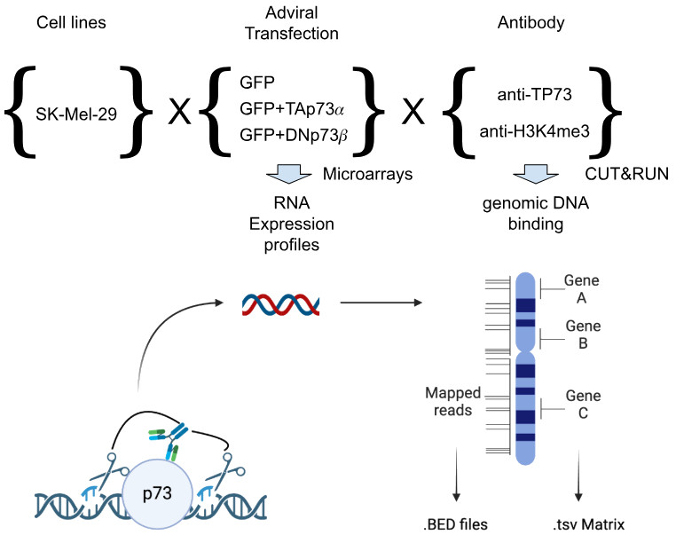

This repository accompanies our publication:

Möller S, Spitschak A, Murr N, Pützer BM. Integrative Multimodal
Profiling of TAp73 and DNp73 Reveals Isoform-Specific Transcriptomic
Coregulator Landscapes in Cancer Programs. Biomolecules. 2025 Dec 31;16(1):63.
PMID: 41594604; PMCID: PMC12839168; DOI: 10.3390/biom16010063.

The source tree performs the
 - differential analysis of _*CUT&RUN*_ data that describe the binding of two variants of the transcription factor p73
 - under consideration of the _*JASPAR*_ database of transcription factor DNA binding motifs.

Applied on the melanoma cell line SK-Mel-29 we thus determined 
 - what cofactors in the immediate vicinity of a p73 binding site (as predicted by JASPAR)
 - is beneficial or detrimental to see the JASPAR-predicted theoretical binding site confirmed by the experimental CUT&RUN data,
 - and how this differs upon overexpression of the full length variant TAp73α of p73, the cancer-specific DNp73β and endogenous levels.


{ width=150px }


Besides helping with reproduction of our findings, we anticipate
the here outlined approach to be adapted (and improved) for other transcription factors. Please get in touch.

## Requirements

For the paper we used

* Data on p73 binding
  - CUT&RUN:  E-MTAB-15709
  - CoIP Mass spectrometry: PXD058816
  - Expression data: E-MTAB-14704
* Jaspar release 2022
* Ensembl version 112

The current R analysis environment is pinned in `renv.lock` for R 4.5.1; it
is an updated environment for this source tree, not a reconstruction of the
publication-era R session. From a fresh checkout, install `renv` once and
restore the recorded CRAN package versions:

```
Rscript -e 'install.packages("renv", repos="https://cloud.r-project.org")'
Rscript -e 'renv::restore(prompt=FALSE)'
```

The standalone Ensembl REST helper has one Python dependency. Install it in a
virtual environment with:

```
python3 -m venv .venv
. .venv/bin/activate
python3 -m pip install -r requirements.txt
```

The C++ build dependencies and FASTA indexing requirements are described in
the installation steps below. Test fixtures keep their contents and suffixes
aligned: the tracked `*_1000.bed` samples are plain BED text, while compressed
inputs must use `.gz` or `.bz2` so `CompressedFileReader` selects the matching
decoder.

New analyses default to JASPAR 2026 in the Makefile. Use
`make JASPAR_VERSION=2022 jaspar` when recreating the publication-era input.
JASPAR matrix files are small and ignored by Git; keep them local to this tree,
or set `JASPAR_DIR=/path/to/cache` when an explicit shared cache is useful.
The Makefile selects the TP73 accession from the JASPAR release by default:
`MA0861.2` for JASPAR 2026 and `MA0861.1` for JASPAR 2022. Override
`TP73_MOTIF_ID` when running a different release.

Compute facilities:

* Storage: ~1 TB for gzipped .bed files generated by JASPAR mapping, more for the 2024 release
* Compute time: <4 weeks on a small cluster of ~20 nodes

## Methods

* Raw data was analysed with protocols of https://nf-co.re.
* Mapping of JASPAR to the genome was performed with the here presented C program, the bed tools and shell scripts.
* R was used for downstream analyses and visualisation.

## Installation

To execute this program
 1. Compile binaries
    - Install dependencies:
      UNIX: sudo apt install libbz2-dev make
      `samtools` is preferred for FASTA indexing; when it is absent, Make uses
      the dependency-free `scripts/build_fasta_index.py` fallback.
    - Compile:
      UNiX: make
 2. Download the exact same genome that your cut'n'run experiments were run against, like +
    `wget https://ftp.ensembl.org/pub/release-112/fasta/homo_sapiens/dna/Homo_sapiens.GRCh38.dna.primary_assembly.fa.gz`
    and
 3. unpack it by +
   `gunzip -c Homo_sapiens.GRCh38.dna.primary_assembly.fa.gz > Homo_sapiens.GRCh38.dna.primary_assembly.fasta`
 4. Create the required FASTA index with `make genome_index` or
    `samtools faidx Homo_sapiens.GRCh38.dna.primary_assembly.fasta`.
    `pssm_scan` uses `${GENOME}.fai` unless `--fasta-index` is provided and
    reads one chromosome at a time in index order for every scan. BGZF-compressed
    FASTA requires matching `.fai` and `.gzi` files. Ordinary gzip and bzip2
    FASTA are not production inputs; unpack ordinary gzip or recompress it with
    `bgzip` and create both indexes.
 5. Download JASPAR with the Makefile default release, currently JASPAR 2026, by running +
    `make jaspar`
 6. Execute `./pssm_scan`, expect separate outputs for every motif and the respective positive and negative strands. The option "--help" provides extra details. The default score mode is `log2_relative_risk`, matching the publication-era behavior; use `--score-mode log_odds` or `make SCORE_MODE=log_odds ...` when running the alternative motif-score filter. Make keeps the historical `output_RelativeRisk_20250217` directory for the default mode and switches non-default score modes to separate output directories unless `OUTPUTDIR` is set explicitly.

Unconstrained, for the full genome, expect an output of ~30 GB for each of the ~2000 motifs of JASPAR. Options are provided to retrieve matches above a given threshold or for particular chromosomal regions. Scanner outputs include a `ScoreMode` column so downstream tables can distinguish sequence-level score filters from later contrast-level log ratios or log odds.

Whole-genome scans retain only the current chromosome sequence and its requested
strand-code arrays. Every motif is scanned before that chromosome is released,
and genome-wide BED rows follow chromosome order from the `.fai` file. This keeps
peak genome memory proportional to the largest chromosome rather than the whole
assembly and gives deterministic chromosome-grouped output.

For production chromosome scans, prefer `make scan_chr_all_motifs CHR=1` over
per-motif invocations. That path loads and encodes the chromosome once, parses
the JASPAR file once, and then scans all motifs in one process. The scanner
stores chromosomes as nucleotide codes and flattens each PSSM before scanning
so the inner loop avoids per-base hash-map lookups. Cluster-specific compiler
flags can be passed without editing the Makefile, for example
`make CXXOPTFLAGS="-march=x86-64-v3"`. Link-time optimization is opt-in via
`make LTO=1`, and can be combined with target-specific flags, for example
`make LTO=1 CXXOPTFLAGS="-march=x86-64-v3"`. Scanner targets rebuild all of
their translation units so these settings and embedded provenance stay
coherent. The chromosome-wide all-motif target
defaults to BED coordinates plus matched sequences (`SCAN_CHR_FLAGS`), matching
the Parquet schema and later half-site architecture derivation. Slurm-level
chromosome or motif-family fan-out remains the default parallelization strategy; OpenMP and direct
compressed BED output are deliberate follow-up choices because they affect job
sizing, log ordering, and downstream file handling.

Long-running scans can report progress on demand without `-v`. On POSIX systems,
send `SIGUSR1` to the running process, for example `kill -USR1 <pid>`. On
platforms with `SIGINFO`, that signal requests the same report. In a Windows
console, press Ctrl+Break; the Windows build handles `CTRL_BREAK_EVENT` without
terminating the scan. Automated Windows callers can use `GenerateConsoleCtrlEvent`
to send `CTRL_BREAK_EVENT`, but the caller and target must share a console and the
target should be started as a console process group. Each mechanism prints one
status line to stderr. Scan-loop reports include the current motif, chromosome,
strand, position, local window count and percentage, global motif and chromosome
indices, the cumulative number of successfully emitted hits, and process elapsed
time. A request received while an indexed FASTA chromosome is loading or while a
Parquet writer is closing is reported at the safe phase boundary as
`fasta_load_start`, `fasta_load_complete`, `parquet_close_start`,
`parquet_close_complete`, or `parquet_close_failed`. Signal handlers only set a
request flag; formatting and I/O remain in ordinary scanner control flow.

Additional scanner controls now include `--strand +|-|both`,
`--coordinate-mode legacy|bed`, and `--min-pwm-relative-score` /
`--max-pwm-relative-score`. The PWM-relative score follows the JASPAR-style
normalization `(score - min_reachable_score) / (max_reachable_score -
min_reachable_score)` over finite, non-sentinel motif scores for the selected
`--score-mode` and is written as a `PWMRelativeScore` output column. The default
coordinate mode remains `legacy`; use `--coordinate-mode bed` for 0-based,
half-open BED-style coordinates in the first three output fields. The default
`--skip-N` avoids reporting windows from long assembly gaps; use `--neutral-N`
only for targeted diagnostics or with thresholds that cannot promote all-N
windows.

Ordinary hit files are placed below a configuration-specific path rooted at
`OUTDIR/hits/`. Its partitions record score mode, effective pseudocount,
threshold, PWM-relative bounds, coordinate mode, sequence inclusion, and N
policy. In particular, an explicit `--threshold 0` uses `threshold-0`, while
an invocation without a threshold uses `threshold-none`; those runs therefore
cannot overwrite each other. The motif, strand, chromosome, and optional
range remain in the BED basename.

With Apache Arrow available, thresholded hits can instead be streamed directly
to ZSTD-compressed Parquet without a BED/TSV intermediate. This mode requires an
explicit score threshold and BED coordinates:

```sh
make pssm_scan_parquet
./pssm_scan_parquet --sparse-parquet \
  --outdir sparse_tp73_chr1 \
  --genome Homo_sapiens.GRCh38.dna.primary_assembly.fasta \
  --pssm JASPAR2026_CORE_non-redundant_pfms_jaspar.txt \
  --motif MA0861.2 --chr 1 --strand both \
  --motif-set-id jaspar2026_core_nonredundant \
  --genome-id homo_sapiens_grch38_ensembl113_primary \
  --score-mode log2_relative_risk --pseudocount 1 \
  --threshold -5 --coordinate-mode bed --skip-N \
  --scan-file-stats sparse_tp73_chr1/scan_file_stats.jsonl
```

Each motif/chromosome/strand file contains only the per-hit columns `start`,
`end`, float32 `score`, float32 `pwm_relative_score`, and nullable
`matched_seq`. Row-constant identity and run configuration live in Hive-style
partitions below `tables/jaspar2026/motif_hit/`, including explicit motif-set
and genome IDs, background and pseudocount semantics, score/PWM bounds, N
policy, and sequence policy. Dataset identity is never inferred from an input
filename. `--motif-list` accepts one accession per line for disjoint batch jobs,
and `--scan-file-stats` writes one JSON record per completed Parquet file with
complete window accounting. Record batches are bounded,
so memory use does not grow with the number of retained hits. A completed file
is published from a staging path only after Parquet closes successfully, and an
existing result is never replaced silently. `--sparse-parquet` does not yet
accept `--regions`; use a chromosome with optional `--from`/`--to` bounds.
The requeue-safe whole-genome planner, per-task validator, immutable inventories,
SIGUSR1 workflow, and human/mouse/rat identity contract are documented in
[`docs/jaspar2026_genome_scan_plan.md`](docs/jaspar2026_genome_scan_plan.md).
The motif-specific informative-or-`-1` policy, chromosome-1 physical-locus
density ceiling, and its scratch-staged production handoff are documented in
[`docs/jaspar2026_informative_density200_scan.md`](docs/jaspar2026_informative_density200_scan.md).
The maintenance contract for node-local chromosome staging, fast finalization,
resumable checksums, portable catalogs, and exact-file queries is documented in
[`docs/scanner_maintenance.md`](docs/scanner_maintenance.md). The observed GRCh38
v3 scale and original finalizer costs are recorded in
[`docs/jaspar2026_grch38_sparse_v3_run_report.md`](docs/jaspar2026_grch38_sparse_v3_run_report.md).

For a bounded context analysis that needs scores below the production storage
floor, `--context-maxima OUTPUT.parquet --regions ANCHORS.tsv` evaluates one
motif around BED-coordinate anchors and writes one maximum per anchor directly
to Parquet. `--context-flank` is a signed interval-edge distance: overlap is
negative and abutment is zero. This Arrow-only mode requires one motif, BED
coordinates, and an explicit `--threshold` as the recoverable source floor.
The chromosome-1 `-20..0` threshold audit is specified in
[`docs/jaspar2026_chr1_negative_threshold_sensitivity.md`](docs/jaspar2026_chr1_negative_threshold_sensitivity.md).

For production provenance, build from the clean commit named in the immutable
plan and inspect `./pssm_scan_parquet --version-json`. The coordinator rejects a
dirty or commit-mismatched scanner unless an explicit diagnostic override is
given. A chromosome-oriented Slurm run can be rendered without submission:

```sh
scripts/submit_genome_scan_slurm.sh \
  --run-root "$RUN" --scanner "$PWD/pssm_scan_parquet" \
  --max-concurrent 20 --batch-workers 1 --finalize --dry-run
```

Each array element copies one indexed chromosome from the durable FASTA into
node-local scratch, verifies its planned sequence digest, and reuses that copy
across all motif batches for the chromosome. The source `.fai` supplies the
byte offset; a new tiny `.fai` describes the staged one-record FASTA to the
unchanged scanner. Neither index affects motif scores.

Finalized metadata can be inspected from any working directory without binding
every hit file:

```sh
scripts/query_genome_scan.py summary --package "$RUN/package"
scripts/query_genome_scan.py hits --package "$RUN/package" \
  --motif MA0861.2 --chrom 1 --minimum-score 0 --limit 20
```

Normal finalization does not reread all Parquet payloads. Use the separate,
checkpointed `manage_genome_scan.py verify --run-root "$RUN" --checksums`
operation when a complete SHA-256 audit is required.

To inspect subthreshold scores without writing one row per genomic window, use
`./pssm_scan --score-distribution` or `make score_distributions_chr1`. The Make
target scans chromosome 1 on the forward strand for every JASPAR motif and
writes per-motif histograms, including negative scores. The default
`DISTRIBUTION_BIN_WIDTH=adaptive` uses bins of 0.2 for scores >= -10, 1 for
scores >= -50, 5 for scores >= -250, 10 for scores >= -1000, 100 for scores
>= -10000, and 500 below that. Set a numeric `DISTRIBUTION_BIN_WIDTH=0.5` for
fixed-width bins, `SCORE_MODE=log_odds` to change the sequence-score mode, or
`PSEUDOCOUNT=1` / `--pseudocount 1` to smooth JASPAR zero counts before
normalization. In unsmoothed `log2_relative_risk` mode, windows hitting
zero-probability motif entries are counted as skipped sentinel windows;
`log_odds` uses `--pseudocount 1` by default and therefore keeps those windows
in the histogram.
Distribution TSVs also include an explicit `BinScheme=sentinel` row when such
windows are present, with `ScoreBinStart=-Inf` and `ScoreBinEnd=-10000`.

For dense chr1 calibration against CUT&RUN coverage, use `--dense-scores` with
one motif and one chromosome. Dense mode writes one score for every possible
alignment start of the motif model to the selected chromosome and strand.
With Arrow support, those alignment scores are written as block Parquet under
a hive-style path such as
`tables/jaspar2026/motif_score_dense/motif_set_id=.../genome_id=.../motif_id=MA0861.2/score_mode=.../pseudocount=1/background_model_id=uniform_acgt_v1/pseudocount_scheme=additive_per_base/chrom=1/strand=plus/part-from=0-to=end-n_policy=skip-000000.parquet`.
Parquet modes require explicit `--motif-set-id` and `--genome-id`; dense part
names also include the requested range and N policy so partial calibrations
cannot replace full-chromosome output.
Under `--skip-N`, alignments crossing assembly gaps are stored as `NULL`
elements. An unsmoothed `log2_relative_risk` alignment that selects an
unobserved motif nucleotide is valid DNA with score `-Inf`, and is retained as
such. This distinction keeps pseudocount comparisons on the same candidate
set. The derived `start`/`end` interval is the sequence span used for PSSM
scoring; it is not intended to define the physical footprint of the bound TF
complex.
Build the direct Parquet scanner with Apache Arrow/Parquet C++ available through
`pkg-config`:

```
make pssm_scan_parquet
./pssm_scan_parquet --dense-scores --dense-block-size 65536 \
  --outdir dense_tp73_chr1_log_ratio \
  --genome Homo_sapiens.GRCh38.dna.primary_assembly.fasta \
  --pssm JASPAR2026_CORE_non-redundant_pfms_jaspar.txt \
  --motif MA0861.2 --chr 1 --strand both \
  --motif-set-id jaspar2026_core_nonredundant \
  --genome-id homo_sapiens_grch38_ensembl113_primary \
  --score-mode log2_relative_risk --pseudocount 1
```

Repeat the same command with `--score-mode log_odds` and a different `--outdir`
for the second TP73 calibration run. The default dependency-free `pssm_scan`
build still writes TSV blocks; `scripts/dense_tsv_to_parquet.sh` remains as a
fallback converter for environments where Arrow is not installed.

For a small end-to-end Parquet/DuckDB exercise around the chromosome 1 TP73
locus, covering PATZ1 (`MA1961.2`) and TP73 (`MA0861.2`) in both score modes and
orientations, run `make dry_run_chr1_patz1_tp73`. The reproducible runner,
read-only inspection commands, full-chromosome gate, and GENtle interpretation
contract are documented in
[`docs/chr1_patz1_tp73_dry_run.md`](docs/chr1_patz1_tp73_dry_run.md) and
[`docs/gentle_chr1_duckdb_interpretation_prompt.md`](docs/gentle_chr1_duckdb_interpretation_prompt.md).
Thresholded BED files can be regenerated without rescanning the genome using
`scripts/export_dense_bed.py`; it filters the dense package by motif,
explicit genome and motif-set identities, configuration, chromosome,
orientation, alignment-start range, and score while streaming directly to
plain or gzip-compressed output. See the dry-run document for examples and the
precise compatibility boundary.
The reproducible Slurm runner for the full chromosome 1 TP73, E2F1, SP1,
PATZ1, and POU2F2 panel is documented in
[`docs/chr1_2026_motif_panel.md`](docs/chr1_2026_motif_panel.md).
The de novo TP73 motif-pair layer, provisional 150 bp context radius, 20 bp
non-overlapping tandem-gap definition, orientation-collapsed singleton/tandem
feature classes, per-distance-band occurrence counts with coupled strongest-hit
geometry, pair-stratified promoter predictors, and transcript/intron features
are documented in
[`docs/tp73_motif_context.md`](docs/tp73_motif_context.md).
The candidate-level exact-distance extension preserves half-base motif-center
offsets and orientation, estimates matched anti-p73/control response curves for
TAp73 and DNp73, and reports prespecified 10.5 bp periodicity plus coherent
single-peak and doublet shifts. Its TF-COMB-derived reporting contract and
commands are documented in
[`docs/tp73_exact_distance_isoform_analysis.md`](docs/tp73_exact_distance_isoform_analysis.md).
The separate, versioned registry of evidence-derived convenient score
thresholds, including explicit pending/no-gain states and the distinction from
scan storage floors, is documented in
[`docs/motif_score_thresholds.md`](docs/motif_score_thresholds.md).
It also defines the zero-complete per-TP73-anchor count of distinct neighboring
motif loci above those thresholds.
The strict CUT&RUN coverage-immersion rule, synthetic local test, threshold
metrics, and true-data landing convention are documented in
[`docs/cutandrun_motif_score_calibration.md`](docs/cutandrun_motif_score_calibration.md).
The completed chromosome-1 anti-p73/IgG threshold comparison and operational
TP73 cutoffs are recorded in
[`docs/tp73_chr1_cutandrun_threshold_20260713.md`](docs/tp73_chr1_cutandrun_threshold_20260713.md).
The matched-storage follow-up using the strongest PATZ1 score within +/-150 bp
of each TP73 alignment is recorded in
[`docs/tp73_patz1_chr1_cutandrun_20260714.md`](docs/tp73_patz1_chr1_cutandrun_20260714.md).
The same chromosome-1 analysis for E2F1 and all three current JASPAR 2026
TFAP2C models, including a count-matched cofactor comparison, is recorded in
[`docs/tp73_e2f1_tfap2c_chr1_cutandrun_20260714.md`](docs/tp73_e2f1_tfap2c_chr1_cutandrun_20260714.md).
The corresponding POU2F2 analysis confirms a strong negative count-matched
association and is recorded in
[`docs/tp73_pou2f2_chr1_cutandrun_20260717.md`](docs/tp73_pou2f2_chr1_cutandrun_20260717.md).
The completed all-JASPAR chromosome-1 screen at schema-7 TP73 local peaks,
including fixed cofactor thresholds, primary enrichment/depletion models,
depth-tier behavior, and comparison with the historical anchor population, is
reported in
[`docs/jaspar2026_chr1_localpeak_enrichment_20260810.md`](docs/jaspar2026_chr1_localpeak_enrichment_20260810.md).
The production extension to whole-genome TP73/control evidence, autosomal
zero-complete context counts, and all-JASPAR enrichment is specified in
[`docs/jaspar2026_tp73_whole_genome_followup.md`](docs/jaspar2026_tp73_whole_genome_followup.md).
It keeps X/Y as a sensitivity partition, mitochondrial aliases as a bystander
control only, and marks negative-reference contrasts as censored whenever a
density-raised scan floor makes absence uninformative.
The separate GFP-referenced H3K4me3 change analysis uses condition-matched
input, predeclared motif-centred windows, and per-series models without a
persistent BED intermediate. Its contract and chromosome-1 pilot are recorded
in [`docs/h3k4me3_cofactor_change.md`](docs/h3k4me3_cofactor_change.md). The
same document gives the restart-safe Slurm production command using schema-7
TP73 local-peak anchors and node-local scratch. The completed production result
is reported in
[`docs/h3k4me3_chr1_production_20260810.md`](docs/h3k4me3_chr1_production_20260810.md).
The schema-9 annotation rebuild adds physical transcript-end/downstream-region
relationships and a four-way promoter/downstream/gene-body/intergenic H3K4me3
analysis to the restart-safe whole-genome workflow specified in
[`docs/h3k4me3_whole_genome_production.md`](docs/h3k4me3_whole_genome_production.md).
The downstream region mirrors the promoter window around each strand-aware
transcript end. Relation-specific figures refit both the matched TP73
occupancy association and the H3K4me3 change within the same anchor class;
they do not reuse one genome-wide occupancy estimate on every panel.

## Automated reference checks

The target `make test_reference_tp73_promoter_chr1` scans E2F1 and the TP53
family motifs in a chromosome 1 window around the TP73 promoter. It uses
JASPAR 2026 motif IDs `MA0024.3` (E2F1), `MA0106.3` (TP53), `MA0525.2`
(TP63), and `MA0861.2` (TP73). The default GRCh38 interval is
`chr1:3651800-3652600`, based on the Ensembl TP73 locus and the E2F-positive
p73 promoter described by Seelan et al. 2002
(https://pmc.ncbi.nlm.nih.gov/articles/PMC1531693/), which reports functional
E2F sites immediately upstream of p73 exon 1 at -284, -155, and -132. This is
a smoke/regression check rather than a biological validation: it asserts at
least one E2F1 hit across both strands in that window.

This target loads the full genome FASTA before applying the interval, so treat
it as an integration check rather than a cheap default unit test. Override
`TEST_REFERENCE_FROM`, `TEST_REFERENCE_TO`, or `TEST_REFERENCE_OUTPUTDIR` when
a different chromosome 1 interval or output location is needed.

For an integration of data from a CUT&RUN experiment without referal to peaks, the bedGraph data may be transformed to .bed files and subsequently be used with bedtools to combined these data with TFBS data.

For the coverage-immersion calibration, overlapping and directly adjacent
positive intervals are deliberately merged before asking whether coverage
extends beyond both boundaries of a motif-model span. BED, bedGraph, and
bigWig are therefore suitable; this analysis does not retain read identity.
 
 . copy or link "*.clipped.clean.bedGraph" files to a local directory
 . inform Makefile about paths and transform .bedGraph to .bed by `make files_cutandrun_clean`

A helper routine was created to filter GTF annotations of genome. This can be used to retrieve genomic coordinates for a set of genes of interest, much like a "quick local BioMart". To execute that program
 1. Compile gtf_file_region_retrieval, again by invocating make.
 2. Download the GTF file accompanying the FASTA file, i.e. https://ftp.ensembl.org/pub/release-112/gtf/homo_sapiens/Homo_sapiens.GRCh38.112.gtf.gz
 3. Execute it ./gtf_file_region_retrieval

`gtf_file_region_retrieval` always emits BED6 coordinates: the start is
0-based and the end is exclusive. A GTF interval `start..end` (1-based,
inclusive) is therefore represented as `[start - 1, end)` in its unfiltered
output.

The `--filter promoter` output contains distances 1 through 500 immediately
upstream of the transcription start site and excludes the TSS itself. For a
plus-strand transcript with BED start `tss`, this is `[tss - 500, tss)`; for a
minus-strand transcript with BED end `end`, it is `[end, end + 500)`. The
`--filter utr` output is currently a TSS-relative downstream window rather
than an annotation-derived UTR: it contains 500 bases including the TSS,
`[tss, tss + 500)` on the plus strand and `[end - 500, end)` on the minus
strand. Intervals extending left of chromosome coordinate zero are clipped at
zero and can consequently be shorter than 500 bases.

The tracked `GeneLists/*.bed` files predate this coordinate correction. They
are historical outputs and must be regenerated before use in the promoter/ML
layer.

Associate all filtered matches of your transcription factor's predicted binding sites with CUT&RUN matches.

 1. Create a folder with a copy of the data you aim to use as a reference of your CUT&RUN data to a dedicated folder. This could be the .bed files or .bigGraph files showing the detected peaks or the coverage genomic regions.
 2. Adjust the variable "PATH_CUTNRUN" in the Makefile.
 3. Adjust the list of .bed files that shall be merged with the predicted p73 binding sites.
 4. Auto-transform the .bigGraph files to .bed files:
    make files_cutandrun_clean
    and inspect the created files.
 5. Map the CUT&RUN results to the predicted TFBS with 
    for i in $(seq 1 22) X Y; do echo $i; make CHR=$i TP73_datatable.bed.gz; done
    which internally invokes "bedtools map" with the output 0 when no map is possible.
