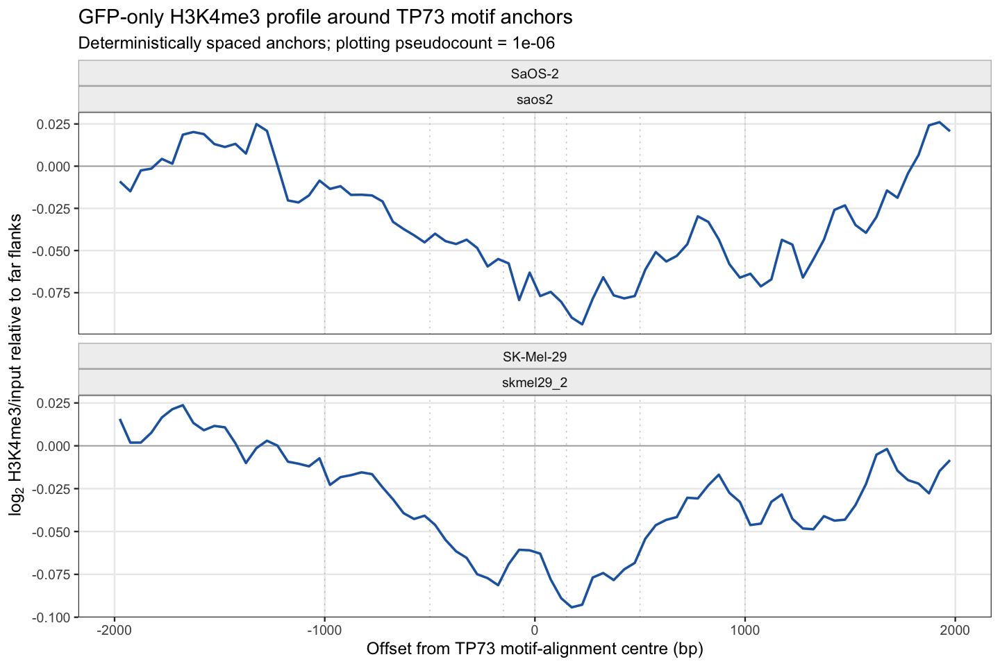

# Chromosome-1 H3K4me3 Window Calibration (2026-08-09)

## Decision

The primary H3K4me3 window is the two-sided annulus **150 to 1000 bp from the
TP73 motif-alignment centre** (`flank_150_1000`). It contains 1700 bp in total.
The motif span, central +/-150 bp, and central +/-1000 bp remain sensitivity
windows.

This choice balances two properties:

1. it remains close enough to represent chromatin around the candidate TP73
   site rather than an unrelated regulatory region; and
2. it excludes the central interval where both accepted experimental series
   show the lowest GFP H3K4me3/input ratio.

The farther 1000-to-2000-bp annulus has a higher baseline ratio, but was not
selected because its signal is less specific to the candidate binding site.

## Blinded calibration

The profile used only GFP H3K4me3 (`pos_*`) and condition-matched input. It did
not read TA, DN, cofactor identity, cofactor score, or CUT&RUN-confirmed TP73
status. A deterministic, genome-ordered sample of 100,000 of the 310,782
chromosome-1 TP73 motif loci was profiled in 50 bp bins from -2000 to +2000 bp.

Included series were `saos2` and `skmel29_2`. `skmel29_1` remained explicitly
excluded and its files were not opened.

The figure subtracts each series' median log2 H3K4me3/input ratio in the far
flanks (`|offset| >= 1500 bp`). This removes the large between-series channel
offset for visualization only. The uncentered ratio and both raw aggregate
signals remain in
[`h3k4me3_gfp_tp73_anchor_metaprofile_chr1_100k.tsv`](figures/h3k4me3_gfp_tp73_anchor_metaprofile_chr1_100k.tsv).

Mean far-flank-centered log2 ratios were:

| Window | SaOS-2 | SK-Mel-29 |
|---|---:|---:|
| central +/-150 bp | -0.0720 | -0.0701 |
| central +/-500 bp | -0.0664 | -0.0719 |
| central +/-1000 bp | -0.0520 | -0.0513 |
| flanks 150-1000 bp | -0.0485 | -0.0480 |
| flanks 1000-2000 bp | -0.0128 | -0.0126 |

The agreement in *shape* is considerably stronger than the agreement in
absolute channel scale. This supports a shared geometry while retaining
separate per-series biological estimates.

## Limits

- The BigWig normalization and clipping provenance remains unresolved in the
  source manifest. Geometry depends on within-series spatial shape and is
  reasonably robust to a multiplicative track offset; publishable effect sizes
  still require the scale metadata.
- The profile is motif-centred and is not oriented to transcription direction.
- Choosing the window with GFP data protects TA/DN inference from direct
  outcome optimization, but the chosen geometry must now remain fixed.
- H3K4me3 change in the central and motif-span windows must still be reported;
  the annular primary window is not evidence that central changes cannot occur.

The full extraction and model contract is documented in
[`h3k4me3_cofactor_change.md`](h3k4me3_cofactor_change.md).
