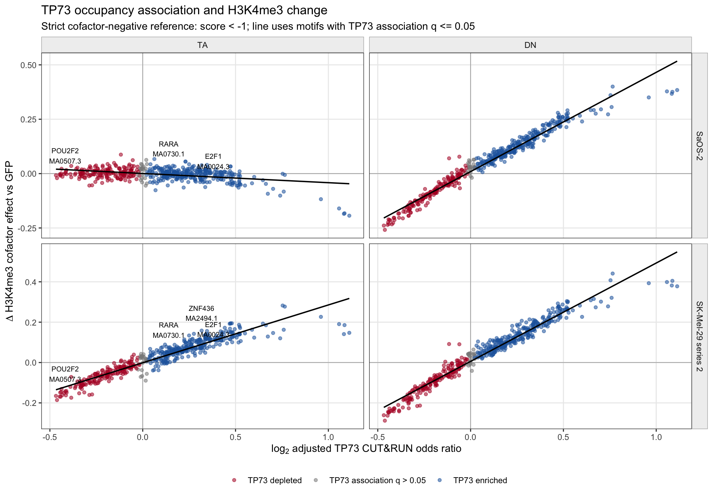
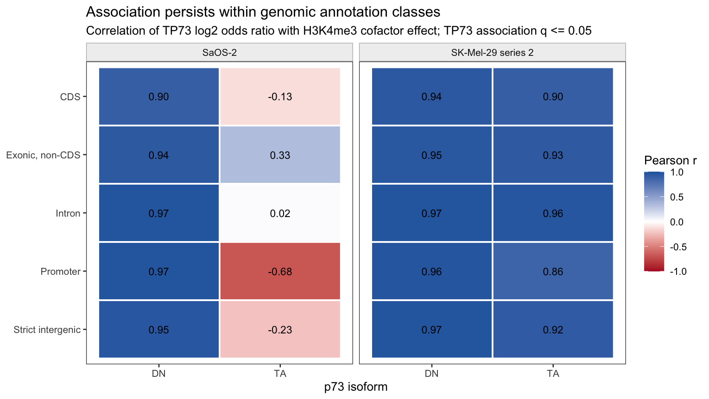

# TP73 Cofactor Enrichment and H3K4me3 Change Across the Autosomes

> **Supersession note (2026-08-13):** This report faithfully describes the
> first density-capped production analysis, but its 2,142 censored motifs make
> the all-JASPAR ranking provisional. The corrected production path derives
> maxima from the existing low-floor scan (`-1` for non-TP73 motifs), retains
> score-zero and operating-threshold counts separately, and will supersede the
> ranking below. The numerical results remain historical provenance and must
> not be interpreted as negative evidence for censored motifs.

## Scope and provenance

This report joins the completed JASPAR 2026 cofactor association and
GFP-referenced H3K4me3 analyses across GRCh38 autosomes 1-22. X and Y are
retained in the upstream nuclear H3K4me3 package but are not part of this
cofactor inference because the production context-maxima package is
autosome-only. The mitochondrial sequence is excluded. SK-Mel-29 series 1 is
not used; SaOS-2 and SK-Mel-29 series 2 are separate experimental systems, not
replicates.

The finalized inputs are:

- TP73 cofactor enrichment:
  `/data/sm718/jaspar_mapping_runs/jaspar2026_grch38_tp73_cofactor_enrichment_autosomes_v1/final/cofactor_enrichment`
- H3K4me3 anchor signal:
  `/data/sm718/jaspar_mapping_runs/jaspar2026_grch38_h3k4me3_anchor_signal_v1/final/genome_h3k4me3_signal`
- H3K4me3 cofactor analysis:
  `/data/sm718/jaspar_mapping_runs/jaspar2026_grch38_h3k4me3_cofactor_analysis_v2/final/h3k4me3_cofactor_analysis`
- Production analysis source commit: `c62274b`.

`scripts/summarize_h3k4me3_genome_cofactors.py` joins the finalized Parquet
results without altering them. It emits immutable Parquet and TSV tables plus
a manifest containing the extraction source commit and input/output checksums.
The primary reference class is cofactor score `< -1`; score `< 0` is retained
as the compatibility sensitivity.

The finalized files can be extracted on Haumea without reading anchor-level
payloads directly:

```sh
ENRICHMENT=/data/sm718/jaspar_mapping_runs/jaspar2026_grch38_tp73_cofactor_enrichment_autosomes_v1/final/cofactor_enrichment
H3_SIGNAL=/data/sm718/jaspar_mapping_runs/jaspar2026_grch38_h3k4me3_anchor_signal_v1/final/genome_h3k4me3_signal
H3_EFFECT=/data/sm718/jaspar_mapping_runs/jaspar2026_grch38_h3k4me3_cofactor_analysis_v2/final/h3k4me3_cofactor_analysis

scripts/summarize_h3k4me3_genome_cofactors.py \
  --enrichment "$ENRICHMENT/tables/jaspar2026/cofactor_primary_occupancy/part-000000.parquet" \
  --intensity "$H3_EFFECT/tables/intensity_effect.parquet" \
  --context "$H3_EFFECT/tables/context_stratified_intensity_effect.parquet" \
  --score-gradient "$H3_EFFECT/tables/score_gradient.parquet" \
  --interaction "$H3_EFFECT/tables/tp73_interaction.parquet" \
  --h3-summary "$H3_SIGNAL/h3k4me3_change_summary_by_chromosome.parquet" \
  --output-dir /data/sm718/jaspar_mapping_runs/jaspar2026_grch38_h3k4me3_cofactor_interpretation_v1 \
  --duckdb /path/to/duckdb
```

The generated `motif_coverage` is the complete estimability registry;
`joint_primary_motif` is the primary motif table; the context, score-gradient,
and TP73-interaction tables retain the secondary long-form effects.

The two committed evidence figures and their context-correlation table are
regenerated from that compact extraction with:

```sh
SUMMARY=/data/sm718/jaspar_mapping_runs/jaspar2026_grch38_h3k4me3_cofactor_interpretation_v1
scripts/plot_h3k4me3_genome_cofactor_summary.R \
  --joint "$SUMMARY/joint_primary_motif.tsv" \
  --context "$SUMMARY/context_primary_effect.tsv" \
  --output-effect docs/figures/h3k4me3_tp73_cofactor_effect_autosomes_20260812.png \
  --output-context docs/figures/h3k4me3_tp73_context_correlations_autosomes_20260812.png \
  --context-table context_correlations_autosomes_20260812.tsv
```

## Estimands

The two quantities joined here must remain distinct:

1. **TP73 occupancy association** is the adjusted odds ratio for TP73 strict
   CUT&RUN immersion among cofactor-positive versus cofactor-negative anchors.
   An odds ratio above one is labelled TP73-enriched and below one
   TP73-depleted.
2. **H3K4me3 cofactor effect** is the adjusted difference in the
   condition-minus-GFP H3K4me3/input change between cofactor-positive and
   cofactor-negative TP73 anchors. It is fitted separately for TA and DN and
   separately in SaOS-2 and SK-Mel-29 series 2.

These are motif-context associations, not evidence that the named TF is
expressed, bound, or causal. `cofactor_present x confirmed_TP73` remains a
secondary post-treatment interaction and is not part of the primary total
association model.

## Estimability and censoring

| Result | Motifs |
|---|---:|
| JASPAR motifs planned | 2,632 |
| Strict `< -1` comparison estimable | 486 |
| Reference below retained scan floor | 2,142 |
| Underpowered anchor class | 4 |
| Historical `< 0` comparison estimable | 601 |

The 2,142 censored motifs are **not null results**. Their density-controlled
sparse scans did not retain sufficiently low scores to construct the negative
reference. This is the largest limitation of the all-JASPAR ranking and is
carried explicitly in `motif_coverage`.

Among the 486 estimable motifs, 295 were TP73-enriched and 169 TP73-depleted at
all-JASPAR Benjamini-Hochberg `q <= 0.05`; 22 were not significant.

## Main result



The TA result is cell-system-specific:

| H3K4me3 contrast | SaOS-2 | SK-Mel-29 series 2 |
|---|---:|---:|
| Correlation of TP73 log odds with TA cofactor effect | -0.413 | +0.944 |
| Motifs with TA effect `q <= 0.05` | 121 | 431 |

Although 110 motifs have a TA effect at `q <= 0.05` in both systems, only 42
have the same sign. TP73-enriched sequence contexts therefore predict a larger
TA-associated H3K4me3 gain very strongly in SK-Mel-29 series 2, but not as a
general cross-system rule. SaOS-2 is weakly inverse overall.

The DN association is different: enrichment log odds correlate with the DN
cofactor effect at approximately `r = 0.983` in SaOS-2 and `r = 0.978` in
SK-Mel-29 series 2. A total of 439 motifs have a DN effect at `q <= 0.05` in
both systems and the signs are almost perfectly aligned with enrichment or
depletion. This does not mean that DN induces H3K4me3. Relative to GFP, mean DN
change is negative in both systems (`-1.618` in SaOS-2 and `-0.341` in
SK-Mel-29 series 2); a positive cofactor coefficient therefore denotes
relative preservation or a smaller loss of the mark.

For orientation, the genome-level TA change relative to GFP is small and
negative in SaOS-2 (mean `-0.059`) and positive in SK-Mel-29 series 2 (mean
`+0.272`). These exactly weighted baseline summaries cover 3,596,429 autosomal
anchors per series.

## Genomic context



The SK-Mel-29 TA relationship persists within every annotation class
(`r = 0.863` to `0.959`), including strict intergenic anchors (`r = 0.922`).
The SaOS-2 TA relationship varies substantially: promoter anchors are inverse
(`r = -0.684`), strict intergenic anchors are weakly inverse (`r = -0.225`),
and exonic non-CDS anchors are weakly positive (`r = 0.333`). No individual
strict-intergenic SaOS-2 motif effect survives the context-family BH correction,
whereas 348 do in SK-Mel-29 series 2. The system difference is therefore not
explained solely by mixing promoters, genes, and intergenic regions.

DN effects remain strongly correlated with TP73 enrichment within every class
in both systems (`r = 0.901` to `0.974`).

## Prespecified cofactors

The strict, estimable motif-level results include:

| Motif | TP73 OR | TA SaOS-2 | TA SK-Mel-29 | DN SaOS-2 | DN SK-Mel-29 |
|---|---:|---:|---:|---:|---:|
| E2F1 `MA0024.3` | 1.302 | -0.024 | +0.078 | +0.187 | +0.176 |
| POU2F2 `MA0507.3` | 0.749 | +0.003 | -0.143 | -0.227 | -0.232 |
| REST `MA0138.3` | 1.238 | +0.019 | +0.117 | +0.169 | +0.171 |
| TFAP2C `MA0815.1` | 1.433 | -0.004 | +0.187 | +0.267 | +0.304 |

This supports E2F1, REST, and TFAP2C `MA0815.1` as enriched sequence contexts
and POU2F2 as a depleted context. Their TA effects are clear in SK-Mel-29 but
near zero or weakly opposite in SaOS-2. The `< -1` and `< 0` sensitivity
results are highly stable among shared motifs: TA effect correlations are
`0.993` in SaOS-2 and `0.997` in SK-Mel-29 series 2, with signs agreeing for
466/486 and 482/486 motifs, respectively.

The requested PATZ1 `MA1961.2`, POU4F1 `MA0790.2`, TCF7 `MA0769.3`, KLF14
`MA0740.2`, TFAP2C `MA0524.3`/`MA0814.3`, and strict-reference SP1 `MA0079.5`
cannot be estimated from this sparse production run because their retained
floors are above the requested negative class. SP1 is available only for the
historical `< 0` sensitivity. This is motif-specific: TFAP2C `MA0815.1`, whose
source floor is `-4`, is estimable.

## Sensitivity analyses

The continuous score-gradient and binary positive/negative estimates have the
same TA sign in both systems for 402/486 motifs. Their effect correlations are
`0.838` in SaOS-2 and `0.955` in SK-Mel-29 series 2; 85 motifs are significant
by both methods in both systems and agree in sign. This supports the primary
binary contrast while retaining score dependence as useful information.

The secondary interaction with CUT&RUN-confirmed TP73 has the same sign in both
systems for 363 motifs (230 positive and 133 negative), but only 32 are
significant in both systems. A further 123 interactions reverse direction.
Because TP73 confirmation is a post-treatment occupancy measure, these values
describe effect modification and must not be used as an adjusted total-effect
claim.

## Candidate sequence signatures

Among motifs with a significant TP73 association and same-direction,
both-series TA effects, recognizable vertebrate profiles include enriched
ZNF436, ZNF732, ZNF623, THRB, RARA, and NR2F1 motifs and depleted MEF2B,
MEF2D, HOXC9, CEBPE, IRF6, MYBL1, and MYBL2 motifs. These are candidates for
factor-level consolidation, not a final ranked cofactor list.

The largest same-direction TA effects among a compact set of recognizable
vertebrate profiles are:

| Direction | Motif | TP73 OR | TA SaOS-2 | TA SK-Mel-29 |
|---|---|---:|---:|---:|
| Enriched | ZNF436 `MA2494.1` | 1.246 | +0.038 | +0.158 |
| Enriched | ZNF732 `MA2528.1` | 1.210 | +0.035 | +0.142 |
| Enriched | ZNF623 `MA2497.1` | 1.189 | +0.043 | +0.134 |
| Enriched | THRB `MA1575.2` | 1.205 | +0.032 | +0.118 |
| Enriched | RARA `MA0730.1` | 1.102 | +0.034 | +0.075 |
| Depleted | MEF2B `MA0660.1` | 0.819 | -0.055 | -0.161 |
| Depleted | MEF2D `MA0773.1` | 0.828 | -0.054 | -0.158 |
| Depleted | HOXC9 `MA0485.3` | 0.838 | -0.038 | -0.105 |
| Depleted | CEBPE `MA0837.3` | 0.882 | -0.024 | -0.093 |
| Depleted | IRF6 `MA1509.1` | 0.891 | -0.032 | -0.079 |

The scan deliberately used the species-agnostic JASPAR collection. Some of the
largest same-direction effects are plant, insect, or nematode matrices, and
many matrices are highly similar. Such rows describe a DNA sequence signature;
they must not be named as human cofactors. The next consolidation should add
JASPAR taxonomic metadata and motif-cluster identity, retain the all-motif
rows, and report vertebrate and motif-cluster summaries alongside them. JASPAR
itself distinguishes six taxonomic groups and recommends selecting profiles by
the relevant taxon rather than only by the species from which a matrix was
derived; see the [JASPAR documentation](https://jaspar.elixir.no/docs/).

## Interpretation and next tests

The strongest defensible finding is a system-specific relationship between
TP73-associated sequence architecture and chromatin change: enriched motifs
track TA-associated H3K4me3 gain in SK-Mel-29, while SaOS-2 shows a different,
especially promoter-inverse pattern. The DN arm supplies a remarkably coherent
directional control, but should be described as modulation of a global loss.

Before factor-level or mechanistic claims:

1. Consolidate similar matrices and add JASPAR taxon/species metadata.
2. Regenerate lower-floor context maxima for the prespecified censored motifs;
   do not treat their current absence as evidence against them.
3. Add density-matched/permuted motif controls and repeat/ALU, GC, and
   mappability covariates.
4. Treat continuous score gradients and TP73-confirmation interactions as
   sensitivity/secondary analyses, not replacements for the primary contrast.
5. Seek biological replication. The two cell systems expose heterogeneity but
   are not replicates from which a population-level variance can be estimated.
